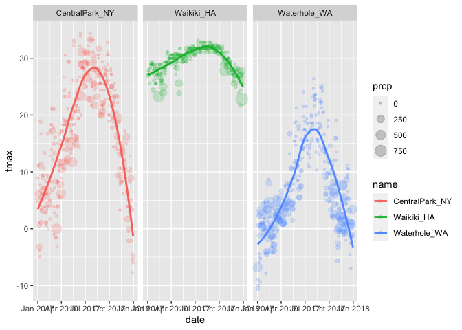
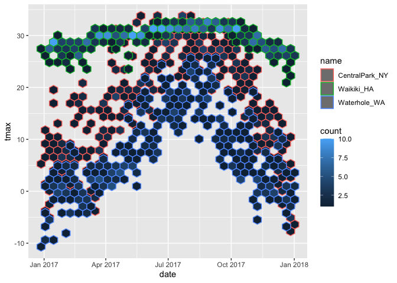
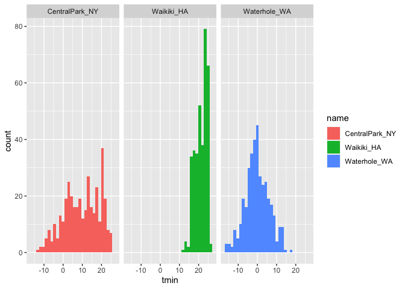
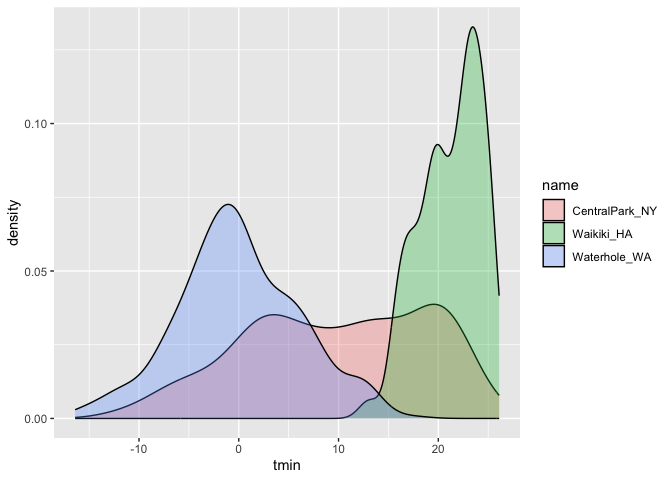
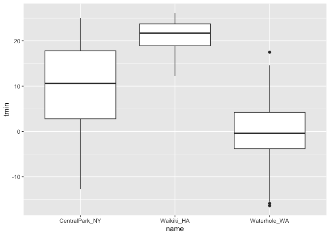
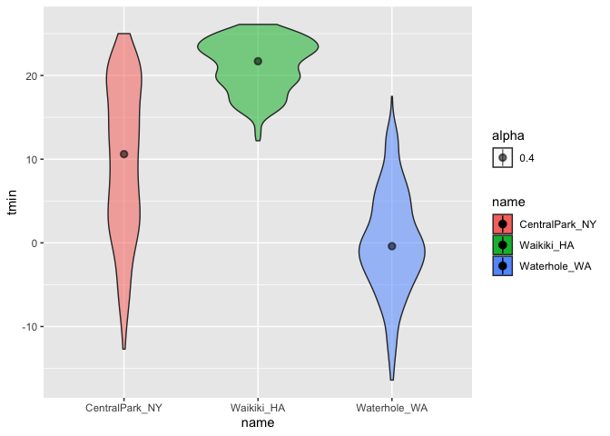
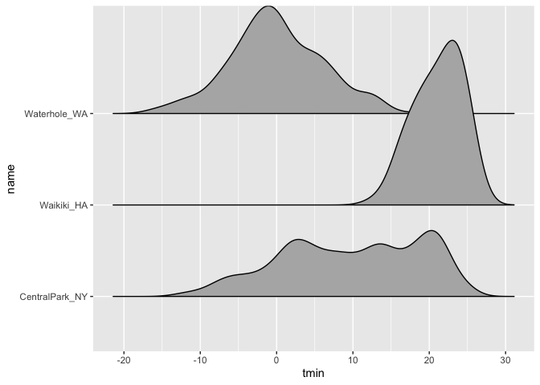
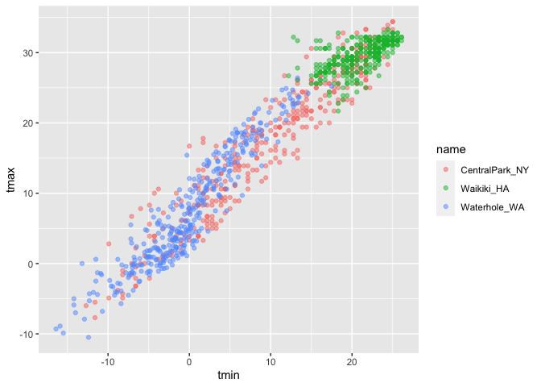
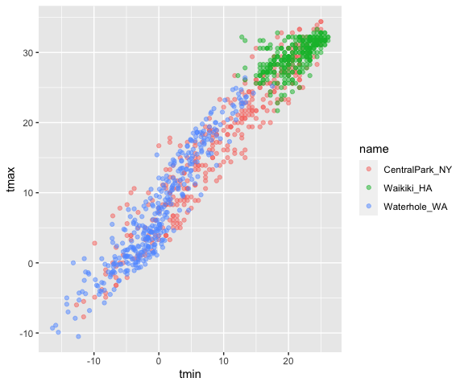

Data_Visualization
================
2023-03-13

``` r
library(tidyverse)
library(ggridges)
```

## load weather data

``` r
weather_df = 
  rnoaa::meteo_pull_monitors(
    c("USW00094728", "USC00519397", "USS0023B17S"),
    var = c("PRCP", "TMIN", "TMAX"), 
    date_min = "2017-01-01",
    date_max = "2017-12-31") %>%
  mutate(
    name = recode(
      id, 
      USW00094728 = "CentralPark_NY", 
      USC00519397 = "Waikiki_HA",
      USS0023B17S = "Waterhole_WA"),
    tmin = tmin / 10,
    tmax = tmax / 10) %>%
  select(name, id, everything())
```

    ## using cached file: ~/Library/Caches/R/noaa_ghcnd/USW00094728.dly

    ## date created (size, mb): 2023-03-12 21:59:01 (8.456)

    ## file min/max dates: 1869-01-01 / 2023-03-31

    ## using cached file: ~/Library/Caches/R/noaa_ghcnd/USC00519397.dly

    ## date created (size, mb): 2023-03-12 21:59:04 (1.699)

    ## file min/max dates: 1965-01-01 / 2020-03-31

    ## using cached file: ~/Library/Caches/R/noaa_ghcnd/USS0023B17S.dly

    ## date created (size, mb): 2023-03-12 21:59:06 (0.973)

    ## file min/max dates: 1999-09-01 / 2023-03-31

## Scatterplots

``` r
ggplot(weather_df,aes(x = tmin, y = tmax)) +
  geom_point()
```

    ## Warning: Removed 15 rows containing missing values (`geom_point()`).

<!-- -->

New approach, same plot

``` r
weather_df %>% 
  ggplot(aes(x = tmin, y = tmax)) +
  geom_point()
```

    ## Warning: Removed 15 rows containing missing values (`geom_point()`).

<!-- -->

Save and edit a plot object

``` r
weather_plot = weather_df %>% 
  ggplot(aes(x = tmin, y = tmax))

weather_plot + geom_point()
```

    ## Warning: Removed 15 rows containing missing values (`geom_point()`).

<!-- -->

## Advanced Scatterplot

``` r
weather_df %>% 
  ggplot(aes(x = tmin, y = tmax, color = name)) +
  geom_point() + 
  geom_smooth(se = FALSE)
```

    ## `geom_smooth()` using method = 'loess' and formula = 'y ~ x'

    ## Warning: Removed 15 rows containing non-finite values (`stat_smooth()`).

    ## Warning: Removed 15 rows containing missing values (`geom_point()`).

<!-- -->

what about the aes placement

``` r
weather_df %>% 
  ggplot(aes(x = tmin, y = tmax)) +
  geom_point(aes(color = name)) + 
  geom_smooth(se = FALSE)
```

    ## `geom_smooth()` using method = 'gam' and formula = 'y ~ s(x, bs = "cs")'

    ## Warning: Removed 15 rows containing non-finite values (`stat_smooth()`).

    ## Warning: Removed 15 rows containing missing values (`geom_point()`).

<!-- -->

Let’s facet some things!!

``` r
weather_df %>% 
  ggplot(aes(x = tmin, y = tmax, color = name)) +
  geom_point() + 
  geom_smooth(se = FALSE) +
  facet_grid(. ~ name)
```

    ## `geom_smooth()` using method = 'loess' and formula = 'y ~ x'

    ## Warning: Removed 15 rows containing non-finite values (`stat_smooth()`).

    ## Warning: Removed 15 rows containing missing values (`geom_point()`).

<!-- -->

facet_grid(. \~ name) row first then column

``` r
weather_df %>% 
  ggplot(aes(x = tmin, y = tmax, color = name)) +
  geom_point() + 
  geom_smooth(se = FALSE) +
  facet_grid(name ~ .)
```

    ## `geom_smooth()` using method = 'loess' and formula = 'y ~ x'

    ## Warning: Removed 15 rows containing non-finite values (`stat_smooth()`).

    ## Warning: Removed 15 rows containing missing values (`geom_point()`).

<!-- -->

alpha transpirency size line

New graph for temp and date LOOK THIS!!!!!!!!!!! size to certain
variable color to seprerate variable

``` r
weather_df %>% 
  ggplot(aes(x = date, y = tmax, color = name)) +
  geom_point(aes(size = prcp), alpha = .2) +
  geom_smooth(se = FALSE) + 
  facet_grid(. ~ name)
```

    ## `geom_smooth()` using method = 'loess' and formula = 'y ~ x'

    ## Warning: Removed 3 rows containing non-finite values (`stat_smooth()`).

    ## Warning: Removed 3 rows containing missing values (`geom_point()`).

<!-- -->

## neat geom

``` r
weather_df %>% 
  ggplot(aes(x = date, y = tmax, color = name)) +
  geom_hex()
```

    ## Warning: Removed 3 rows containing non-finite values (`stat_binhex()`).

<!-- -->
\## Univariate plots

Histogram

``` r
weather_df %>% 
  ggplot(aes(x = tmin)) +
  geom_histogram()
```

    ## `stat_bin()` using `bins = 30`. Pick better value with `binwidth`.

    ## Warning: Removed 15 rows containing non-finite values (`stat_bin()`).

<!-- -->

add color

use fill not color use dodge for full comp

``` r
weather_df %>% 
  ggplot(aes(x = tmin, fill = name)) +
  geom_histogram(position = "dodge") 
```

    ## `stat_bin()` using `bins = 30`. Pick better value with `binwidth`.

    ## Warning: Removed 15 rows containing non-finite values (`stat_bin()`).

<!-- -->

``` r
weather_df %>% 
  ggplot(aes(x = tmin, fill = name)) +
  geom_histogram() +
  facet_grid(. ~ name)
```

    ## `stat_bin()` using `bins = 30`. Pick better value with `binwidth`.

    ## Warning: Removed 15 rows containing non-finite values (`stat_bin()`).

<!-- -->

use density for smooth histogram

``` r
weather_df %>% 
  ggplot(aes(x = tmin, fill = name)) +
  geom_density(alpha = .3)
```

    ## Warning: Removed 15 rows containing non-finite values (`stat_density()`).

<!-- -->

Box Plot

can give x as categorical variable

``` r
weather_df %>% 
  ggplot(aes(x = name, y = tmin)) +
  geom_boxplot()
```

    ## Warning: Removed 15 rows containing non-finite values (`stat_boxplot()`).

<!-- -->

Trendy plots, like a box plot

``` r
weather_df %>% 
  ggplot(aes(x = name, y = tmin, fill = name, alpha = .4)) +
  geom_violin() +
  stat_summary(fun = "median")
```

    ## Warning: Removed 15 rows containing non-finite values (`stat_ydensity()`).

    ## Warning: Removed 15 rows containing non-finite values (`stat_summary()`).

    ## Warning: Removed 3 rows containing missing values (`geom_segment()`).

<!-- -->

Ridge plots

``` r
weather_df %>% 
  ggplot(aes(x = tmin, y = name)) +
  geom_density_ridges2()
```

    ## Picking joint bandwidth of 1.67

    ## Warning: Removed 15 rows containing non-finite values
    ## (`stat_density_ridges()`).

<!-- -->

## Save and Embed

Save plot

``` r
weather_plot = 
  weather_df %>% 
  ggplot(aes(x = tmin, y = tmax, color = name)) +
  geom_point(alpha = .5)
  geom_smooth(se = FALSE)
```

    ## geom_smooth: na.rm = FALSE, orientation = NA, se = FALSE
    ## stat_smooth: na.rm = FALSE, orientation = NA, se = FALSE
    ## position_identity

``` r
ggsave("weather_plot.pdf", weather_plot,width = 8, height = 5)
```

    ## Warning: Removed 15 rows containing missing values (`geom_point()`).

embedding

``` r
weather_plot
```

    ## Warning: Removed 15 rows containing missing values (`geom_point()`).

<!-- -->

``` r
weather_plot
```

    ## Warning: Removed 15 rows containing missing values (`geom_point()`).

<!-- -->
