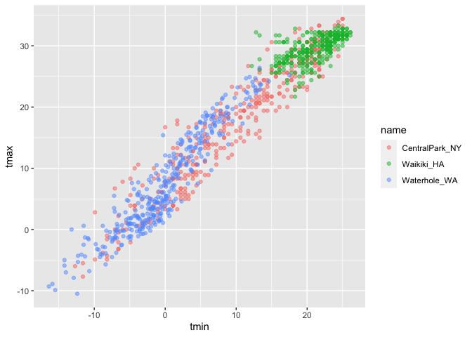
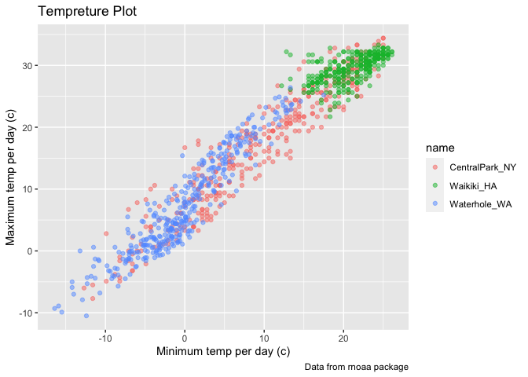
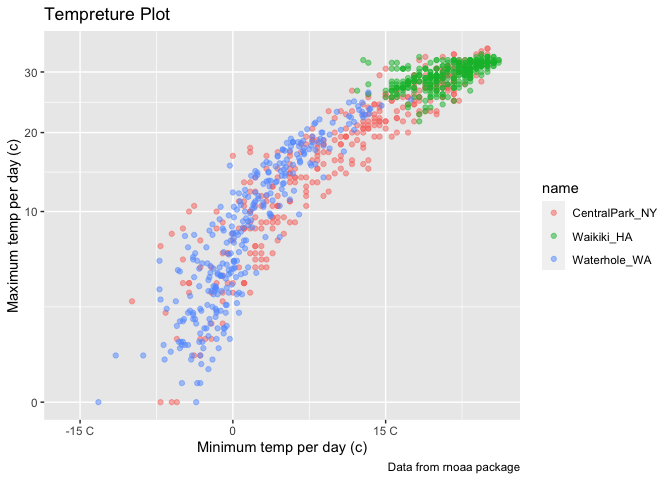
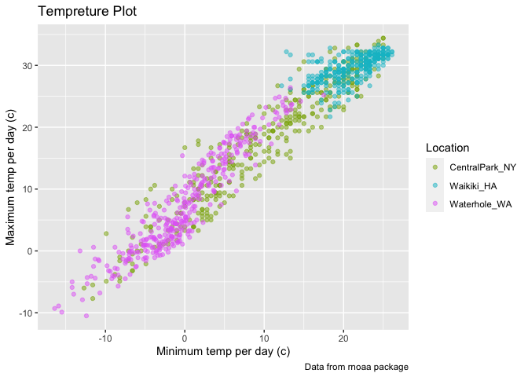
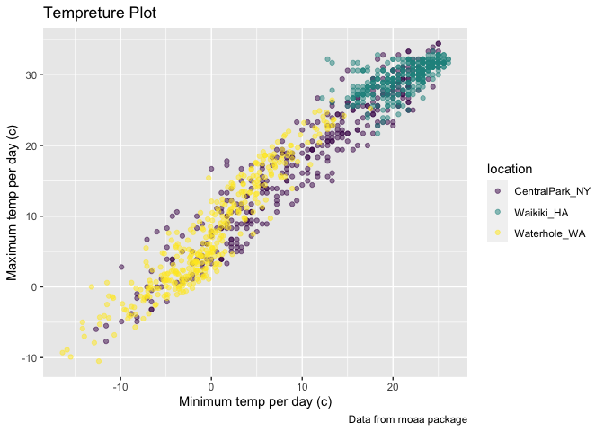

Data_Visualization_Part_2
================
2023-03-13

``` r
library(tidyverse)
library(patchwork)
```

``` r
weather_df = 
  rnoaa::meteo_pull_monitors(
    c("USW00094728", "USC00519397", "USS0023B17S"),
    var = c("PRCP", "TMIN", "TMAX"), 
    date_min = "2017-01-01",
    date_max = "2017-12-31") %>%
  mutate(
    name = recode(
      id, 
      USW00094728 = "CentralPark_NY", 
      USC00519397 = "Waikiki_HA",
      USS0023B17S = "Waterhole_WA"),
    tmin = tmin / 10,
    tmax = tmax / 10) %>%
  select(name, id, everything())
```

    ## using cached file: ~/Library/Caches/R/noaa_ghcnd/USW00094728.dly

    ## date created (size, mb): 2023-03-12 21:59:01 (8.456)

    ## file min/max dates: 1869-01-01 / 2023-03-31

    ## using cached file: ~/Library/Caches/R/noaa_ghcnd/USC00519397.dly

    ## date created (size, mb): 2023-03-12 21:59:04 (1.699)

    ## file min/max dates: 1965-01-01 / 2020-03-31

    ## using cached file: ~/Library/Caches/R/noaa_ghcnd/USS0023B17S.dly

    ## date created (size, mb): 2023-03-12 21:59:06 (0.973)

    ## file min/max dates: 1999-09-01 / 2023-03-31

## last session plot

``` r
weather_df %>% 
  ggplot(aes(x = tmin, y = tmax, color = name)) +
  geom_point(alpha = .5)
```

    ## Warning: Removed 15 rows containing missing values (`geom_point()`).

<!-- -->

## Labels

``` r
weather_df %>% 
  ggplot(aes(x = tmin, y = tmax, color = name)) +
  geom_point(alpha = .5) +
  labs(
    title = "Tempreture Plot",
    x = "Minimum temp per day (c)",
    y = "Maximum temp per day (c)",
    caption = "Data from rnoaa package"
  )
```

    ## Warning: Removed 15 rows containing missing values (`geom_point()`).

<!-- -->

## Scales

``` r
weather_df %>% 
  ggplot(aes(x = tmin, y = tmax, color = name)) +
  geom_point(alpha = .5) +
  labs(
    title = "Tempreture Plot",
    x = "Minimum temp per day (c)",
    y = "Maximum temp per day (c)",
    caption = "Data from rnoaa package"
  ) +
  scale_x_continuous(
    breaks = c(-15, 0, 15),
    labels = c("-15 C", "0", "15 C")
  ) +
  scale_y_continuous(
    trans = "sqrt"
  )
```

    ## Warning in self$trans$transform(x): NaNs produced

    ## Warning: Transformation introduced infinite values in continuous y-axis

    ## Warning: Removed 90 rows containing missing values (`geom_point()`).

<!-- -->

sqrt for long tail or log

Look at color scales

``` r
weather_df %>% 
  ggplot(aes(x = tmin, y = tmax, color = name)) +
  geom_point(alpha = .5) +
  labs(
    title = "Tempreture Plot",
    x = "Minimum temp per day (c)",
    y = "Maximum temp per day (c)",
    caption = "Data from rnoaa package"
  ) +
  scale_color_hue( name = "Location" ,h = c(100,300))
```

    ## Warning: Removed 15 rows containing missing values (`geom_point()`).

<!-- -->

Package viridis for color manipulation

``` r
weather_df %>% 
  ggplot(aes(x = tmin, y = tmax, color = name)) +
  geom_point(alpha = .5) +
  labs(
    title = "Tempreture Plot",
    x = "Minimum temp per day (c)",
    y = "Maximum temp per day (c)",
    caption = "Data from rnoaa package"
  ) +
  viridis::scale_color_viridis(
    discrete = TRUE,
    name = "location"
  )
```

    ## Warning: Removed 15 rows containing missing values (`geom_point()`).

<!-- -->
